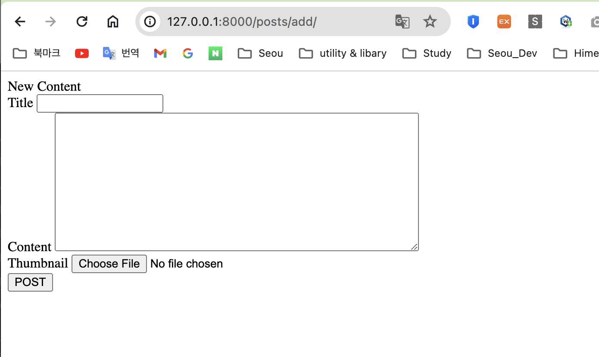

## Seou's blog

### 2024-03-10 ~

# Install Django and Initial settings

> pip3 install django
> python3 -m venv .venv
> django-admin startproject config .

## Check Blog project structure

pyblog
|---config
| |-**init**.py
| |- asgi.py
| |- settings.py
| |- urls.py
| ㄴ wsgi.py
|-- manage.py
|-- templates/
|-- blog
ㄴㅡ users

## Implementing a post and comment modelseou

- comment 1:N link
  title| content
  post| text
  post2|text
  post3|text

- Post Table
  ID| title
  1| content
  2| content
  3| content 

- 글과 연결된 댓글 테이블
  Id|Post Id| Comment
  1|1|comment 1번과 연결됨
  2|1|comment 1번과 연결됨
  3|3|comment 3번과 연결됨

1:N 관계로 테이블을 구성

## 모델 구현

> python3 manage.py startapp blog

config/settings.py

INSTALLED_APPS = [
"blog",
# 기존내용
. . .
]

#### blog/models.py 모델 추가

#### makemigration, migrate로 테이블 생성

> python3 manage.py makemigrations
> python3 manage.py migrate

## Post admin 구성

1. Superuser 생성

> python3 manage.py createsuperuser

2. 개발 서버실행, admin에 글 생성

> python3 manage.py runserver

3. Comment admin 구성

blog/admin 작성

## 글과 댓글 보여주기
### 글(Post) 목록 보여주기

1. view 할수의 이름은 post_list
2. URL 은 /posts/ 
3. templates/ post_list.html
4. VIEW, URL, templates Links
5. View에서 ORM을 사용해 모든 글목록을 가져와 템플릿에 전달
6. 전달 받은 내용 표시

## USER가 입력한 정적 파일의 분류
pyblog/media/

- settings.py

STATIC_URL: "static/"
STATICFILES_DIRS=[BASE_DR / "static"]

<!-media 관련 설정 추가 -> 
MEDIA_URL = ' media/"
MEDIA_ROOT = BASE_DIR/"media"

> makemigration 으로 DB 변경 내역을 만들어준다.

* Django에서 이미지를 다룰수 있는 Pillow라는 이미지 처리라이브러리 설치
> pip3 install Pillow

설치 후 
> python manage.py makemigrations
> python manage.py migrate 변경사항 DB wjrdyd

## 글 상세 페이지 생성

1. View: blog/views.py - post_detail
2. URL : ID가 1번인 글 /posts/1/
3. Template: templates/post_detail.html 

- 상세페이지 View에서 ORM을 사용해 URL로 전달된 post_id값을 id로 갖는 Post를 가져온다

## 글 작성 페이지 생성

1. View: blog/views.py - post_add
2. URL: /posts/add
3. Template: templates/post_add.html

### error 1
Post 요청에 대한 Forbidden 오류
찾아보니
CSRF 공격이란다.

- Django의 CSRF 공격 방어: 
Template(HTML파일)에서 **** 태그를 사용하면, 이영역은 브라주저별로 구분되는 값으로 치한된단다.
값이 포함된 form으로 요청을 보내고 Django는 요청에 브라우저별로 구분되는 값이 포함되어있는 것을 확인, POST요청을 수락한다,

- templates/post_add.html
    . . .
<h1> Post Add </h1>
<form method="POST">
    
    

    . . . .

### error 2,3
MultiValueDictKeyError at /posts/add/

. . . . 
 . . .
etc. **오 타 !!**

## CSS 적용 및 링크 생성
1. 네비게이션 바를 추가하고 글 작성 div에 **post-add** id 속성을 추가
2. 버튼에 btnbtn-primary로 2개의 class 속성을 추가.

### 문제: 메인 post_list 화면에 comment가 보이지않는다...

- 주말에 찾아봐야겠다.아무리 봐도 잘못된 곳이 없다. 또 오타인가.. 아닌데
쳇 GPT에게 물어봤는데 ㅋㅋ

